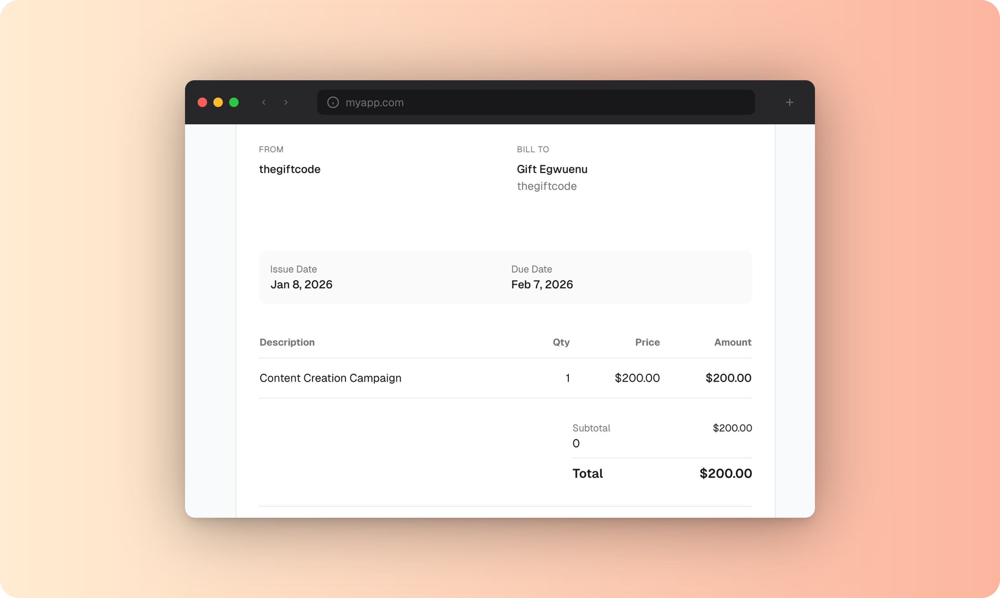

<p align="center">
  
</p>

<h1 align="center">Moqup</h1>

<p align="center">
  <strong>Drop. Frame. Ship.</strong>
</p>

<p align="center">
  A free, open-source screenshot mockup generator.<br>
  Create beautiful mockups with device frames, gradient backgrounds, and shadows.
</p>

<p align="center">
  <a href="#features">Features</a> •
  <a href="#demo">Demo</a> •
  <a href="#quick-start">Quick Start</a> •
  <a href="#usage">Usage</a>
</p>

---

## Demo

<p align="center">
  
</p>

## Features

| Feature | Description |
|---------|-------------|
| 📱 **Device Frames** | iPhone, MacBook, iPad, Pixel, Browser, Monitor |
| 🎨 **Backgrounds** | Gradient presets, solid colors, custom gradients, transparent |
| ⚙️ **Customization** | Adjustable padding, shadows, border radius |
| 🌐 **Browser URL** | Dynamic URL input for browser frame mockups |
| 📤 **Export Options** | PNG (1x/2x/3x), social media sizes, SVG |
| ⌨️ **Keyboard Shortcuts** | `Ctrl+S` to export, `Esc` to reset |
| 🌙 **Dark Theme** | Clean, minimal interface |

## Quick Start

```bash
# Install dependencies
npm install

# Start dev server
npm run dev

# Build for production
npm run build

# Deploy to Cloudflare Workers
npm run deploy
```

## Usage

<table>
<tr>
<td width="33%" align="center">

**1. Drop**

Drag & drop, paste `Ctrl+V`, or click to upload

</td>
<td width="33%" align="center">

**2. Frame**

Choose device, background, padding & shadows

</td>
<td width="33%" align="center">

**3. Ship**

Export as PNG or SVG

</td>
</tr>
</table>

## Tech Stack

- [TanStack Start](https://tanstack.com/start) - React framework
- [Tailwind CSS v4](https://tailwindcss.com) - Styling
- [Cloudflare Workers](https://workers.cloudflare.com) - Deployment
- [html-to-image](https://github.com/bubkoo/html-to-image) - Export functionality

## License

MIT

---

<p align="center">
  Made with ❤️ by <a href="https://github.com/lauragift21">Gift Egwuenu</a>
</p>
